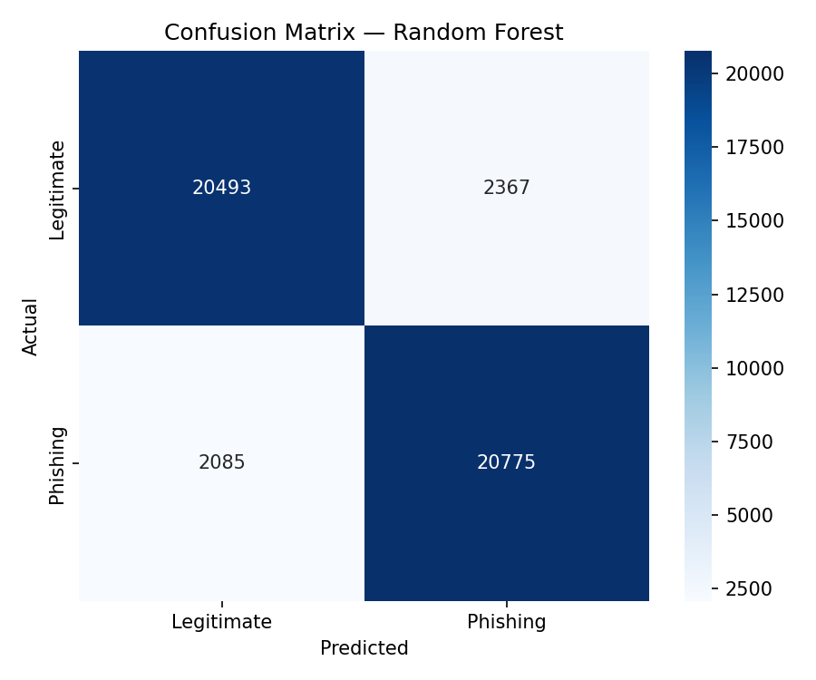
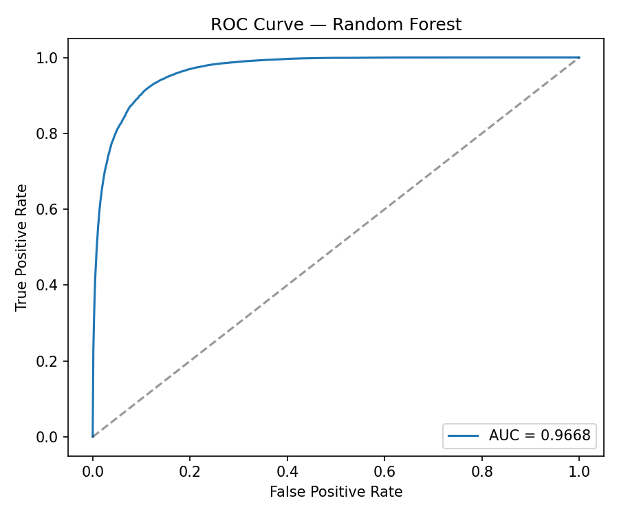
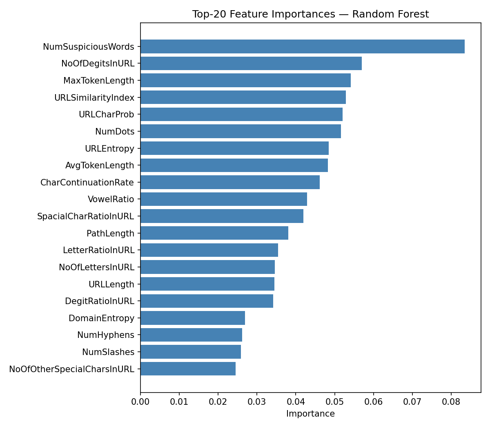
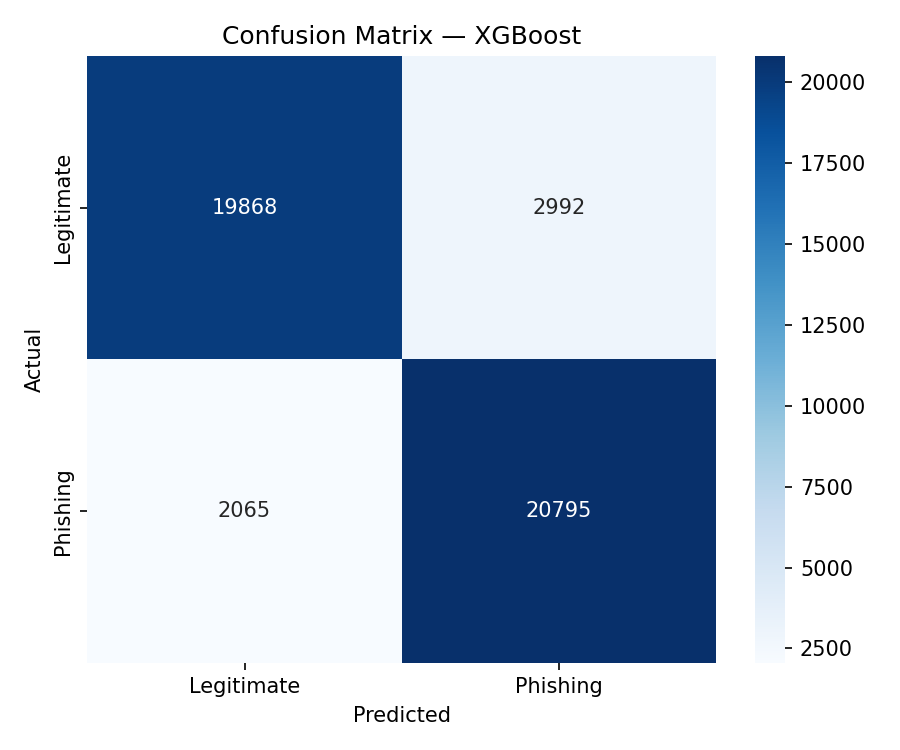
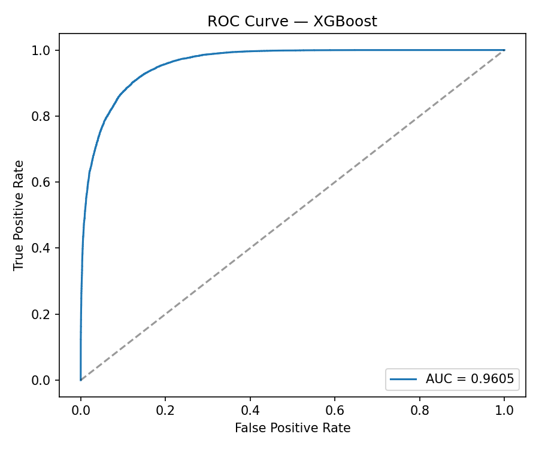
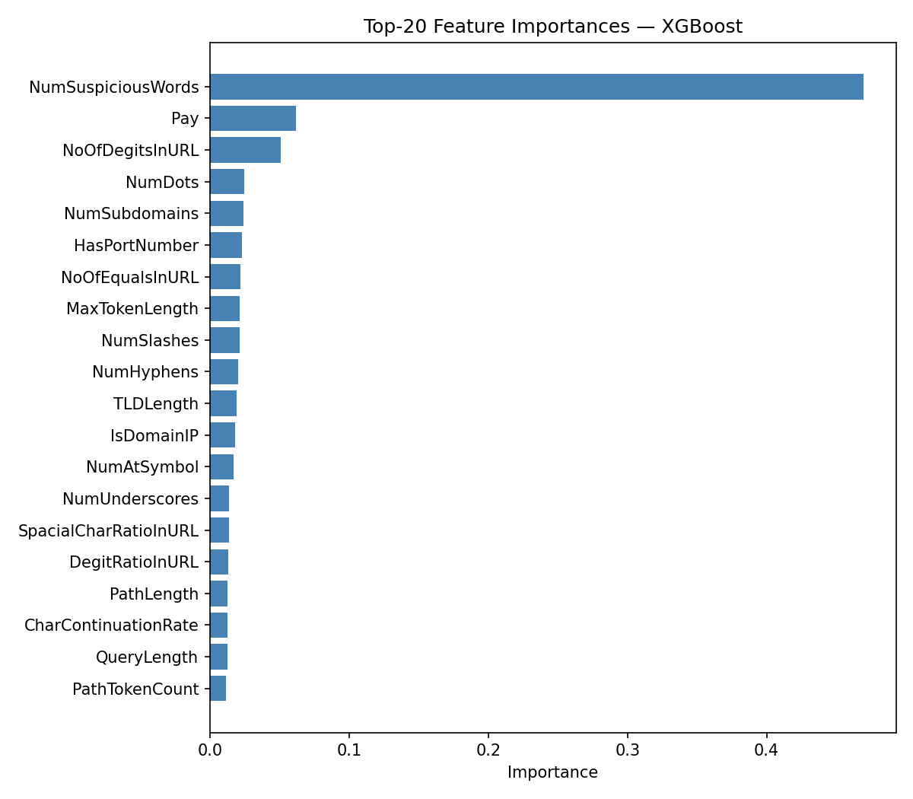
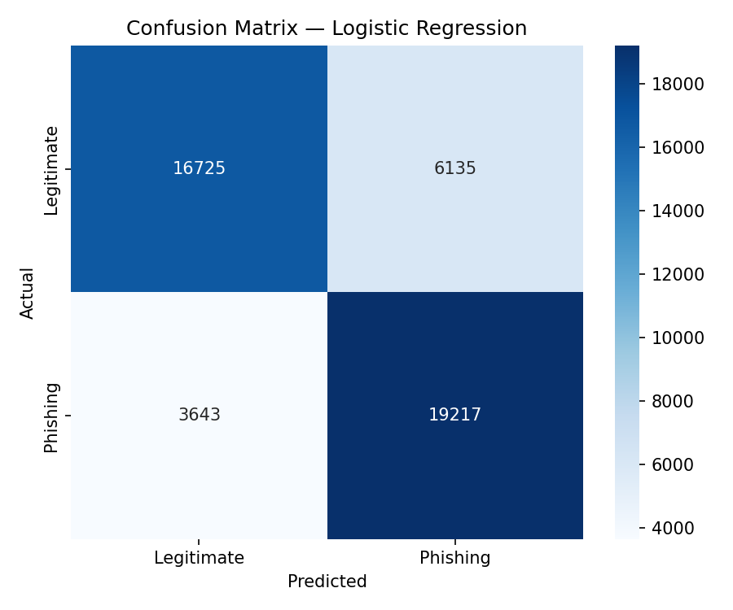
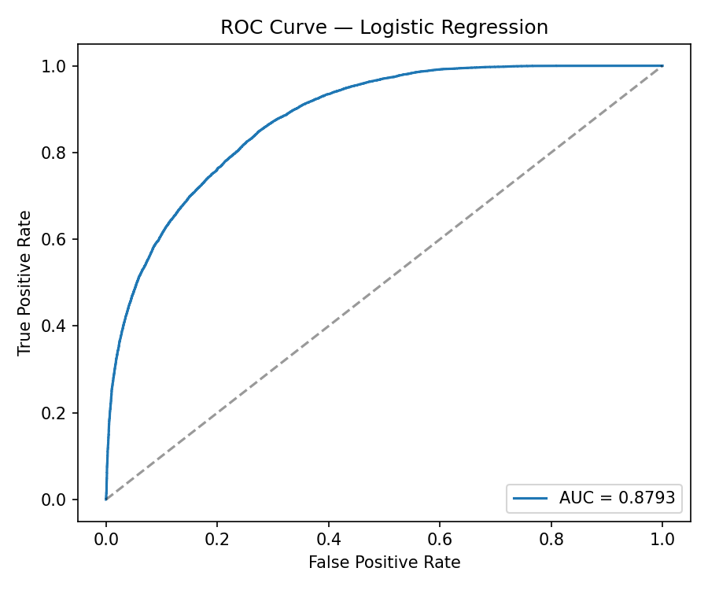

# URL Phishing Detection: Model Training Report

## Dataset Overview
The dataset consists of URL-based features processed to distinguish between legitimate and phishing links.

* **Total Shape:** (228,596, 50)
* **Features Used:** 44
* **Training Set:** 182,876 samples
* **Test Set:** 45,720 samples
* **Dropped Columns:** `URL`, `Domain`, `TLD`, `Label`, `TLDLegitimateProb`

---

## Model Comparison Summary
The following table compares the performance of the three trained models on the test set.

| Model                   |  Accuracy  | Precision  |   Recall   |  F1-Score  |  ROC-AUC   | Training Time |
|:------------------------|:----------:|:----------:|:----------:|:----------:|:----------:|:-------------:|
| **Random Forest**       | **0.9026** | **0.8977** |   0.9088   | **0.9032** | **0.9668** |     6.87s     |
| **XGBoost**             |   0.8894   |   0.8742   | **0.9097** |   0.8916   |   0.9605   |   **0.93s**   |
| **Logistic Regression** |   0.7861   |   0.7580   |   0.8406   |   0.7972   |   0.8793   |    10.34s     |

---

## Detailed Results per Model

### 1. Random Forest (We like this one)
**Performance:** Very consistent. Its ROC curve hugs the top-left corner tightly, showing high reliability.

**Key Features:** _NumSuspiciousWords_ was by far the most significant predictor, followed by technical URL structures like **NoOfDigitsInURL** and **MaxTokenLength**.

#### Classification Report
| Class       | Precision | Recall  |
|:------------|:---------:|:-------:|
| Legitimate  |   0.91    |  0.90   |
| Phishing    |   0.90    |  0.91   |

#####  Confusion Matrix

##### ROC Curve

##### Feature Importance

### 2. XGBoost
**Performance:** While slightly less accurate than Random Forest, it is the most efficient choice for real-time applications due to its **0.93s training time**.
**Phishing Detection:** It actually had the highest **Recall (90.97%)**, meaning it missed the fewest actual phishing attempts.

#### Classification Report
| Class       | Precision | Recall  |
|:------------|:---------:|:-------:|
| Legitimate  |   0.91    |  0.87   |
| Phishing    |   0.87    |  0.91   |

#####  Confusion Matrix

##### ROC Curve

##### Feature Importance

### 3. Logistic Regression
**Performance:** Significantly weaker at identifying complex patterns. The confusion matrix shows a higher number of false positives (6,135) compared to the ensemble models.
**Use Case:** Best used as a simple, interpretable baseline rather than a production-ready detector.

#### Classification Report
| Class       | Precision | Recall  |
|:------------|:---------:|:-------:|
| Legitimate  |   0.76    |  0.73   |
| Phishing    |   0.76    |  0.84   |

##### Confusion Matrix

##### ROC Curve

---

### And the winner is... 🥁 Random Forest!🎉
* **Highest Accuracy:** 90.26%
* **Best Error Balance:** As seen in its Confusion Matrix, it maintains the lowest overall misclassification rate. AKA it doesn't shit itself
* **Superior Separation:** It achieved an **AUC of 0.9668**, indicating an excellent ability to distinguish between classes even if the classification threshold is adjusted.

#### Possible alternatives
A LSTM model (Deep Learning Model) will possibly yield better results, achieving 95% accuracy. But... I'm too bored now. Will try after implementing mlFlow for model repo.

Also, a DL Model ( i.e. Transformer ) would be suited for the scam/suspicious model that i want to create for messages. But there is a big danger! If the model will be trained locally 
there are 3 possible outcomes; 1. Training will take too long, 2. Training won't be completed, 3. I'll start a campfire with my laptop.

_problems for future me_

---

## 🚀 Model Comparison Summary

| Model                   |  Accuracy  | Precision  |   Recall   |  F1-Score  |  ROC-AUC   | Training Time |
|:------------------------|:----------:|:----------:|:----------:|:----------:|:----------:|:-------------:|
| **Random Forest**       | **0.9026** | **0.8977** |   0.9088   | **0.9032** | **0.9668** |     6.87s     |
| **XGBoost**             |   0.8894   |   0.8742   | **0.9097** |   0.8916   |   0.9605   |   **0.93s**   |
| **Logistic Regression** |   0.7861   |   0.7580   |   0.8406   |   0.7972   |   0.8793   |    10.34s     |

